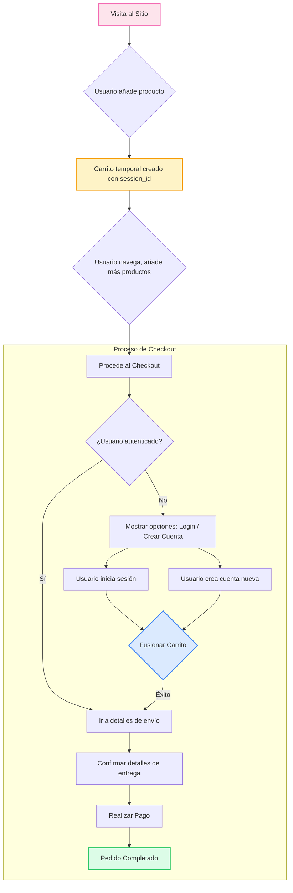

# Arquitectura del Carrito Híbrido: Invitado y Usuario

## 1. Visión General de la Arquitectura

El sistema de carrito de Florarte está diseñado como un **carrito híbrido**, una estrategia moderna que busca el equilibrio perfecto entre la flexibilidad para el usuario y la integridad de los datos para el negocio. El objetivo principal es minimizar la fricción inicial permitiendo que cualquier visitante (invitado) pueda agregar productos a su carrito, y solo requerir la autenticación o el registro en el momento crucial del checkout.

La arquitectura se sustenta en dos identificadores clave:

-   **`session_id`**: Un identificador único generado para cada visitante que llega al sitio. Se almacena en una cookie `httpOnly` para persistir entre sesiones y visitas, permitiendo que el carrito "recuerde" al usuario anónimo.
-   **`user_id`**: El identificador único para usuarios registrados y autenticados.

El sistema utiliza una tabla de transición en la base de datos, `cart_items_stage`, que puede asociar un artículo de carrito ya sea a un `session_id` o a un `user_id`. Esto nos permite gestionar ambos tipos de carritos de manera unificada en el backend.

---

## 2. Diagrama de Flujo del Usuario



---

## 3. Estructura de la Base de Datos (MySQL)

La clave de esta arquitectura reside en la tabla `cart_items_stage`, que está diseñada para ser flexible.

### Tabla: `cart_items_stage`

Esta tabla almacena los artículos de todos los carritos, tanto de invitados como de usuarios registrados.

-   **`id`** (PK): Identificador único para cada línea de artículo en el carrito.
-   **`session_id`** (VARCHAR, INDEX): Almacena el UUID del carrito del invitado. Es **NULL** si el artículo pertenece a un usuario registrado.
-   **`user_id`** (INT, FK, INDEX): Almacena el ID del usuario registrado. Es **NULL** si el artículo pertenece a un invitado.
-   **`product_id`** (INT, FK): Referencia al producto.
-   **`variant_id`** (INT, FK, NULLABLE): Referencia a la variante del producto, si aplica.
-   **`quantity`** (INT): Cantidad del producto.
-   **`is_complement`** (BOOLEAN): Indica si el artículo es un complemento.
-   **`parent_cart_item_id`** (INT, FK, NULLABLE): Si es un complemento, referencia al ID del artículo principal al que está asociado.
-   **`created_at`**, **`updated_at`**: Timestamps de auditoría.

**Lógica Clave**: Un `CHECK constraint` en la base de datos asegura que **solo uno** entre `session_id` y `user_id` puede tener un valor (el otro debe ser `NULL`), garantizando la integridad de la propiedad del carrito.

---

## 4. Estrategia de Sesiones e Identidad

1.  **Visitante Nuevo**:
    -   Alguien llega al sitio. El middleware `src/middleware.ts` intercepta la primera petición.
    -   Verifica si la cookie `session_id` existe. Si no, genera un nuevo `uuidv4()`.
    -   Establece la cookie `session_id` en la respuesta, que será almacenada por el navegador del cliente. Esta cookie tiene una duración prolongada (ej. 30 días) para persistir el carrito entre visitas.

2.  **Operaciones del Carrito (Invitado)**:
    -   Cuando un invitado agrega un producto, el frontend envía la petición a la API (`/api/cart/add`).
    -   La API lee la cookie `session_id` para identificar el carrito temporal y realiza la operación en `cart_items_stage` usando este `session_id`.

3.  **Inicio de Sesión y Fusión**:
    -   El usuario decide iniciar sesión.
    -   Después de una autenticación exitosa (vía `/api/users/login`), el frontend inmediatamente realiza una llamada al endpoint `POST /api/cart/merge`.
    -   Esta petición envía el `session_id` actual (leído desde la cookie) junto con el token de autenticación del usuario.
    -   El backend:
        a. Valida el token del usuario para obtener su `user_id`.
        b. Llama al servicio `cartService.mergeGuestCart`, el cual ejecuta una consulta `UPDATE` en la tabla `cart_items_stage`.
        c. La consulta busca todos los artículos con el `session_id` proporcionado y les asigna el `user_id` del usuario, poniendo `session_id` en `NULL`.
        d. Se encarga de manejar conflictos (ej. si el usuario ya tenía el mismo producto en su carrito persistido), generalmente sumando las cantidades.

---

## 5. Endpoints REST Clave

-   **`POST /api/cart/add`**:
    -   Agrega un producto/variante/complemento al carrito.
    -   Usa `getIdentity` para obtener `userId` o `sessionId`.
    -   Llama a `cartService.upsertItem` que busca un item existente o crea uno nuevo.

-   **`GET /api/cart`**:
    -   Obtiene el contenido completo del carrito actual (para invitado o usuario).
    -   `getIdentity` determina qué carrito buscar.

-   **`POST /api/cart/merge`**:
    -   **Endpoint Crítico**. Se llama solo después del login/registro.
    -   Recibe el `session_id` del carrito de invitado.
    -   El `userId` se obtiene del token de autenticación.
    -   Orquesta la fusión de los carritos en la base de datos.

-   **`POST /api/checkout/init`**:
    -   **Paso final y protegido**. Requiere `userId` (autenticación obligatoria).
    -   Recibe todos los detalles del pedido (dirección, dedicatoria, etc.).
    -   Llama al procedimiento almacenado `sp_Checkout_Init` que realiza las validaciones finales de stock y precios, y crea la orden en estado `pendiente_pago`.
    -   Genera el `PaymentIntent` con el proveedor de pagos (ej. Stripe).

---

## 6. Lógica de Fusión y Ejemplo

### Backend (Express/Node.js - Adaptado a Next.js)

La lógica reside en `src/services/cartService.ts`.

```typescript
// En src/services/cartService.ts

// ...
  async mergeGuestCart(sessionId: string, userId: number): Promise<{ merged: number, items: number, subtotal: number }> {
    const guestItems = await cartRepository.findItemsBySessionId(sessionId);

    if (guestItems.length === 0) {
      // No hay nada que fusionar, solo devuelve el estado actual del carrito del usuario.
      const userCart = await this.getCartContents({ userId, sessionId: null });
      return { merged: 0, items: userCart.totalItems, subtotal: userCart.subtotal };
    }
    
    // 1. Asignar todos los items del carrito de invitado al usuario en la BD.
    // Esta operación se encarga de la lógica de duplicados dentro de la transacción.
    await cartRepository.assignToUser(sessionId, userId);
    
    // 2. Re-validar los cupones que pudieran estar aplicados al carrito ahora unificado.
    await cartRepository.revalidateCoupons({ userId, sessionId: null });
    
    // 3. Obtener el estado final y completo del carrito del usuario.
    const finalCart = await this.getCartContents({userId, sessionId: null});

    return {
      merged: guestItems.length,
      items: finalCart.totalItems,
      subtotal: finalCart.subtotal,
    };
  }
// ...
```

### Frontend (Angular - Adaptado a React/Next.js)

La lógica reside en `src/context/AuthContext.tsx`.

```typescript
// En src/context/AuthContext.tsx

// ...
  const login = async (credentials: LoginCredentials): Promise<AuthResult> => {
    setLoading(true);
    try {
      // 1. Obtiene el sessionId ANTES de realizar el login
      const guestSessionId = getCartSessionId(); // Función de utils/cart-session

      // 2. Autentica al usuario y obtiene su sesión
      const loggedInUser = authService.login(credentials);
      
      // 3. Si había un carrito de invitado, llama al endpoint de fusión
      if (guestSessionId) {
        await apiFetch('/api/cart/merge', {
          method: 'POST',
          body: JSON.stringify({ sessionId: guestSessionId }),
        });
      }

      // 4. Actualiza el estado local del usuario y del carrito
      await fetchUserData();

      return { success: true, message: 'Inicio de sesión exitoso.' };
    } catch (error: any) {
      return { success: false, message: error.message };
    } finally {
      setLoading(false);
    }
  };
// ...
```

---

## 7. Buenas Prácticas y Seguridad

-   **Validación en Backend**: Todos los precios, stock y códigos de cupón se validan en el backend durante la inicialización del checkout (`sp_Checkout_Init`), no se confía en los datos enviados por el cliente.
-   **Transacciones**: Las operaciones complejas como la creación de un pedido o la fusión de carritos deben estar envueltas en transacciones de base de datos para garantizar la atomicidad.
-   **Cookies `httpOnly`**: La cookie de sesión (`session_id`) debe ser `httpOnly` para prevenir su acceso desde JavaScript del lado del cliente, reduciendo el riesgo de ataques XSS.
-   **CSRF Tokens**: Para operaciones que modifican estado (agregar al carrito, login), se debe implementar protección CSRF. Next.js ofrece soluciones integradas para esto.
